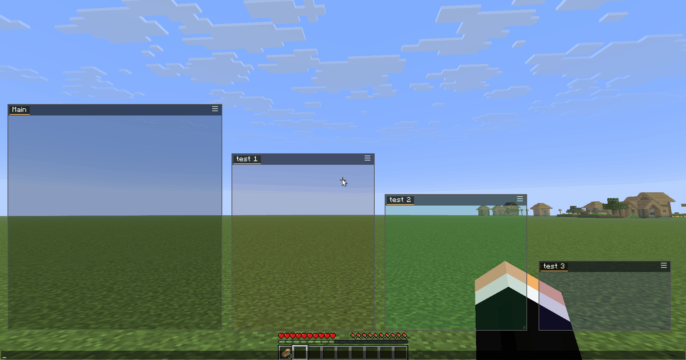
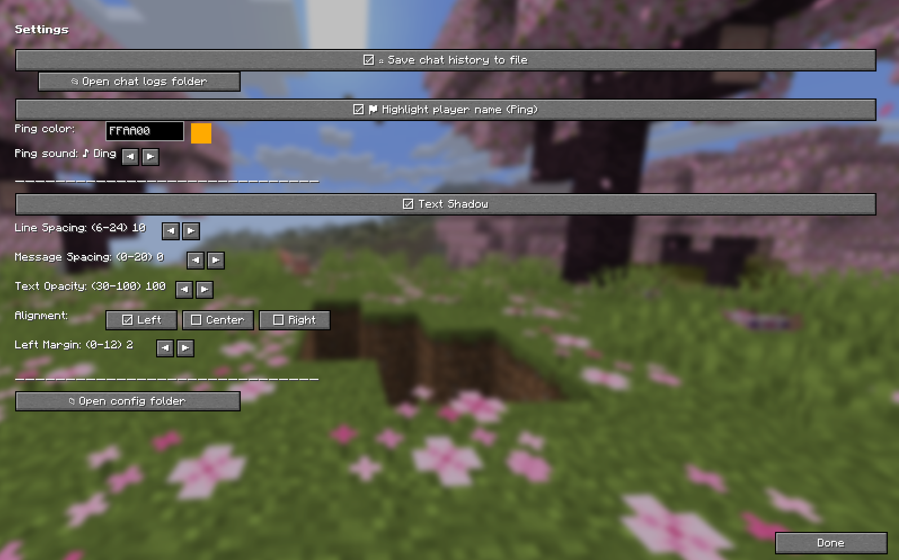
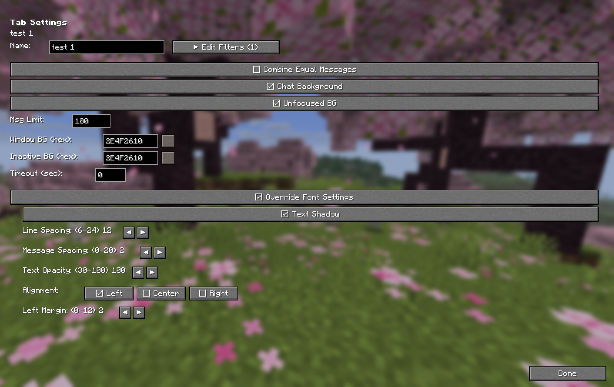
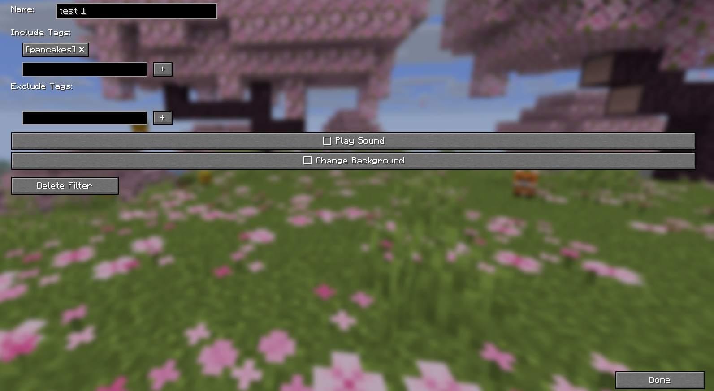

# 🗨️ AnonChat Mod

**Advanced chat customization for Minecraft 1.21.1 – 1.21.5, 26.1.2 & 26.2**

Take full control of your chat experience. Organize messages into separate windows, filter out noise, highlight player mentions, save chat history, and switch between complete configuration profiles — all without leaving the game.

---

## ✨ Features

### 📑 Multi-Window Chat
- Create **unlimited chat windows** — drag, resize, position anywhere on screen
- Each window holds **multiple tabs** for organizing different chat topics
- Independent **font settings** per tab (size, spacing, alignment, shadow)
- Smart **edge snapping** — windows snap to screen edges when dragged close

### 🔍 Advanced Filters
Define **include** and **exclude** tags for each tab to route messages exactly where you want them:
- **Include tags** — only messages containing these words appear in this tab
- **Exclude tags** — messages with these words are blocked from this tab
- Filters work with **LabyMod's JSON format** — you can migrate your existing filter setup
- Optional: play a sound, change background color, or highlight on match

### 🔔 Player Mention (Ping)
- Automatically highlights your **username** in chat messages when someone mentions you
- Choose your **highlight color** and **notification sound** (6 sounds to pick from)
- Your own messages never trigger a ping — only others mentioning you

### 💾 Configuration Profiles
- Save your entire setup (windows, tabs, filters, macros, font settings) as **named profiles**
- Switch between profiles instantly — great for different servers or playstyles
- Export/import by copying profile files from `profiles/` folder
- **"default" profile** is always available and protected from deletion

### ⌨️ Autotext (Macros)
- Assign **keyboard shortcuts** to send messages or execute commands
- Perfect for frequently used commands or chat responses

### 📝 Chat Log
- Automatically saves all chat messages to daily text files
- Located in the `chatlog/` folder next to your config
- Enable/disable toggle in Settings

### 🌐 Internationalization
- Full **English** and **Polish** language support
- Language auto-detects from your Minecraft game settings

---

## 📦 Installation

1. Install [Fabric Loader](https://fabricmc.net/use/) — `0.16.9+` for 1.21.1–1.21.5, `0.19.3+` for 26.1.2/26.2
2. Install [Fabric API](https://modrinth.com/mod/fabric-api) — `0.110.0+1.21.1` for 1.21.x, `0.154.2+26.1.2` / `0.154.2+26.2` for 26.x
3. Make sure you have the required Java version — `Java 21+` for 1.21.x, `Java 25+` for 26.x
4. Download the AnonChat Mod JAR for your version
5. Place the JAR in your `mods/` folder
6. (Optional) Install [ModMenu](https://modrinth.com/mod/modmenu) for an additional config entry point

---

## 🎮 How to Use

### First Launch
- Press the **hamburger icon (☰)** on any chat window
- Click **> Settings** to open the configuration screen
- Or press the keybind (if set via ModMenu)

### Creating Windows & Tabs
- Use the **hamburger menu** on any window to add/remove tabs or create new windows
- In Settings → left panel, expand/collapse windows and manage individual tabs

### Setting Up Filters
1. Select a tab in the left panel
2. Click **▶ Edit Filters**
3. Add **Include** tags — messages with these words go to this tab only
4. Add **Exclude** tags — messages with these words are blocked everywhere
5. Configure additional actions: play sound, change background

### Using Profiles
1. In Settings → **☰ Profiles**
2. Click **■ Save** to save your current setup as a profile
3. Click **▶ Load** to switch to a different profile
4. Use the **✕** button to delete custom profiles

### Migrating from LabyMod
Your existing `chat.json` from LabyMod is **fully compatible**. Simply:
1. Copy your `chat.json` to `%APPDATA%/AnonChatMC/chat.json` (Windows)
2. Or use the **profiles** feature to import specific filter configurations
3. All your filters, windows, and settings will work immediately

---

## 🖥️ Configuration File Location

| OS | Path |
|---|---|
| **Windows** | `%APPDATA%/AnonChatMC/chat.json` |
| **macOS** | `~/Library/Application Support/AnonChatMC/chat.json` |
| **Linux** | `~/.local/share/AnonChatMC/chat.json` |

> **Tip:** Use the **"Open config folder"** button in Settings → Appearance to quickly access your files.

---

## 📜 License

This project is licensed under the **GNU Affero General Public License v3.0 (AGPL-3.0)**.

> **TL;DR:** You are free to use, modify, and distribute this mod. If you modify it and provide a service using it (e.g., a server or launcher), you must make your modified source code available to users.

---

## 🤝 Credits

- **Author:** [AnonBOTpl](https://github.com/AnonBOTpl)
- **Built with:** Fabric Loom, Minecraft mappings
- **Special thanks to:** The LabyMod team for their excellent chat filter system which inspired this mod's design. AnonChat is fully compatible with LabyMod's `chat.json` format for easy migration.
